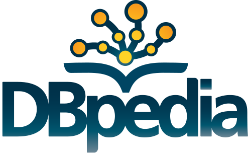

**Contact Us**
==============

This tool was developed under the `Google Summer of Code` program, mentored by the open-source organisation `DBpedia <http://wiki.dbpedia.org/>`_.

The inception of this project was in `Google Summer of Code 2016`, and the it's detailed progress report can be found `here. <https://github.com/dbpedia/extraction-framework/wiki/GSoC_2016_Progress_Federica>`_ This was the first version of the tool and the tool and was developed by Federica.

The project continued for the `Google Summer of Code 2017` program too, adding many features and improvements to the existing project. The progress reports of this year's contributions can be found `here. <https://github.com/dbpedia/list-extractor/wiki/GSoC-2017:-Krishanu-Konar-progress>`_ The few related blog posts to the progress can be found `here. <http://techyrazzi.blogspot.in//search/label/GSoC)>`_

Have Questions? 
-------------------
Post your queries on the `DBpedia support page` `here. <https://dbpedia.atlassian.net/wiki/questions>`_

You can also email the developers with your queries or open issues on the GitHub page in case of bugs.

Want to Contribute? 
------------------------
The repository for List-Extractor can be found `here. <https://github.com/dbpedia/list-extractor>`_ 

Fork this repository, experiment, tinker, find and fix bugs and add new domains/mapping rules or features. You can then send a pull request for your enhancements/bug fixes.
 
Get in Touch
-----------------

You can also email the developers in case of queries, suggestions and improvements :)

* **Krishanu Konar**: <krishanukonar@gmail.com>

* **Federica Baiocchi**: <feddiebai@gmail.com>
